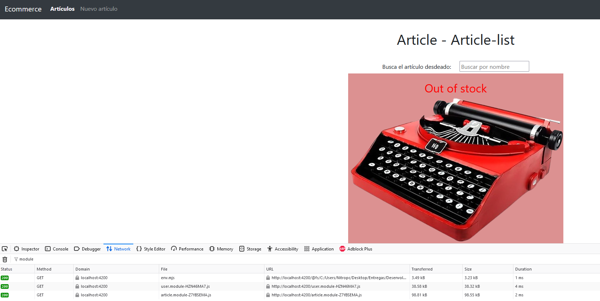
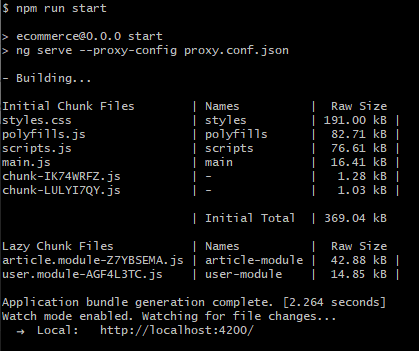

# PAC7 - Desenvolupament front-end amb frameworks Javascript

## Dades del alumne

- asantaeugenia@uoc.edu
- Aitor Javier Santaeugenia Marí
- En aquesta PAC hem realitzat diversos exercicis;
    - L'<ins>exercici 1</ins> consta de preguntes teòriques sobre elements o directives del <code>< RouterOutlet ></code> així com a saber que son les <code>< RouteGuards ></code>. També sobre *lazy-loading* o *middlewares*.
    - L'exercici 2 consta de la creació de diferents rutes, així com la creació d'un <ins>servei</ins> *user-store* o un <ins>interceptor</ins> *article-app* per emmagatzemar el *token*, així com a emprar les *RouteGuards* per no poder accedir a la pàgina de creació d'articles.

---

<code>Repassant els punts més importants d'aquest exercici</code>
- Creació article-detail:

<div align="center">
        
 

</div>

- Visualització de les rutes creades:
    - Podem veure les <ins>diferents rutes creades **/user/login** **/user/register** **/article/list**</ins>
    - Podem veure com, <ins>sense estar autenticats</ins> **NO** podem accedir a la creació d'un nou article a **/article/create**
    - Podem veure com <ins>després d'autenticar-se</ins>, **SI** podem accedir a **/article/create**
    - Els botons de **Login** / **Registre** <ins>desapareixen</ins> després un cop l'usuari s'ha autenticat
    - El botó <ins>**logout**</ins> apareix un cop l'usuari s'ha autenticat

<div align="center">
        
 

</div>

- Creació del <ins>**token**</ins>:

<div align="center">
        
 

</div>

---

- L'exercici 3 s'han de <ins>crear dos mòduls</ins>: *article-module* i *user-module* i s'ha d'<ins>aplicar **lazy-loading**</ins>.
    - Demostra del lazy-loading:

<div align="center">
        
 

</div>

<div align="center">
        
 <br>
*No coincideixen ja que es un altre npm run start*.
 
</div>

- article-module
```ts
import { NgModule } from '@angular/core';
import { CommonModule } from '@angular/common';
import { FormsModule, ReactiveFormsModule} from '@angular/forms';
import { ArticleRoutingModule } from './article-routing.module';


import { ArticleItemComponent } from './../../components/article-item/article-item.component';
import { ArticleNewReactiveComponent } from './../../components/article-new-reactive/article-new-reactive.component';
import { ArticleListComponent } from './../../components/article-list/article-list.component';
import { ArticleDetailComponent } from './../../components/article-detail/article-detail.component';
import { DefaultImagePipe } from './../../pipes/default-image.pipe';

@NgModule({
  imports: [
    CommonModule,
    FormsModule,
    ArticleRoutingModule,
    ReactiveFormsModule
  ],
  declarations: [
    ArticleDetailComponent,
    ArticleItemComponent,
    ArticleListComponent,
    ArticleNewReactiveComponent,
    DefaultImagePipe
  ]
})

export class ArticleModule { }
```

- user-module

```ts
import { NgModule } from '@angular/core';
import { CommonModule } from '@angular/common';

import { LoginComponent } from '../../components/user/login/login.component';
import { RegisterComponent } from '../../components/user/register/register.component';

import { UserRoutingModule } from './user-routing.module';
import { FormsModule, ReactiveFormsModule } from '@angular/forms';

@NgModule({
  imports: [
    CommonModule,
    FormsModule,
    UserRoutingModule,
    ReactiveFormsModule
  ],
  declarations: [
    LoginComponent,
    RegisterComponent
  ]
})
export class UserModule { }
```

<code>Cal dir que per l'aplicació del lazy-loading vàrem haver de modificar l'arxiu angular.json i inserir "namedChunks": true per tal de poder visualitzar els noms dels mòduls.</code>

Podem anar al repositori en el següent [enllaç](https://github.com/AitorSantaeugenia/PEC7_DFFJ).

